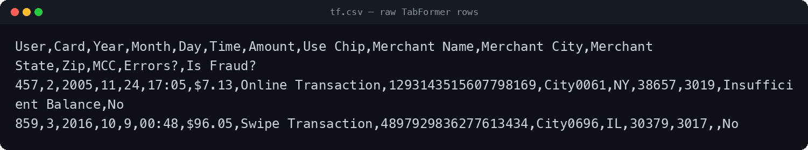
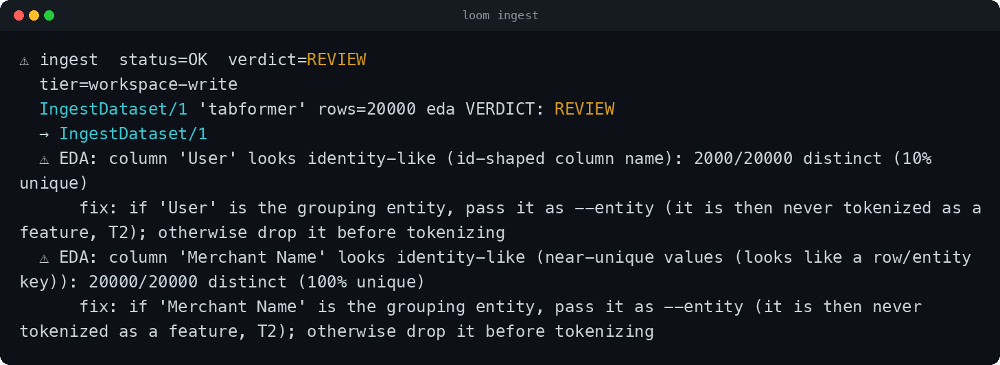
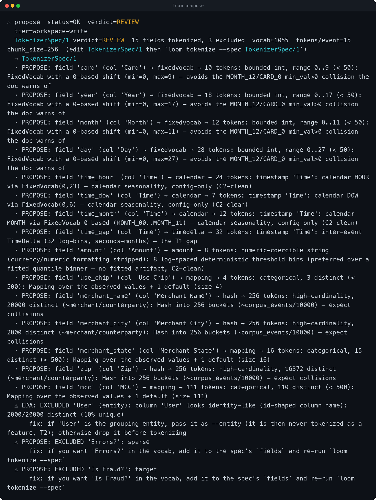
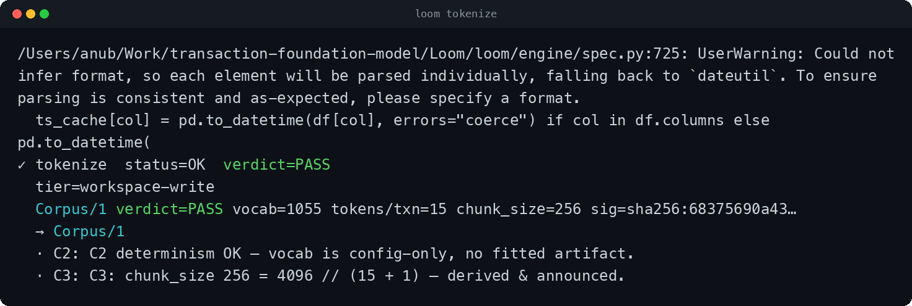
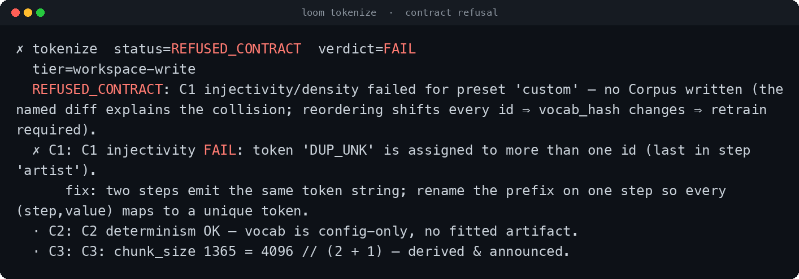
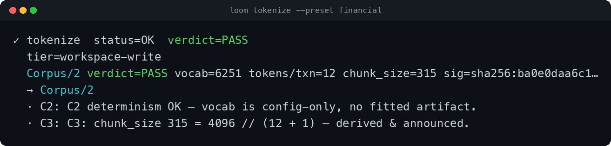

# Demo — tokenizing the TabFormer transactions dataset with Loom

> A step-by-step script for a ~5-minute screen recording. It shows Loom turning the
> **real TabFormer credit-card dataset** (the one the TFM repo trains on) into a
> contract-checked tokenizer in three commands — and contrasts that with the
> ~1,500 lines of bespoke tokenizer code you'd write *going alone*.
>
> Every command and output below is real. Numbers are from the reproducible sample
> ([`tabformer_sample.py`](./tabformer_sample.py), seeded) so what you record matches
> this script exactly; on the full 24.4M-row CSV the strategy choices are identical
> and the preset vocabulary is the same 6,251.

---

## The story you're telling

> "This is TabFormer — IBM's credit-card dataset, 24 million transactions, the data
> our transaction foundation model trains on. Before a model can learn anything, every
> row has to become tokens. Normally that's weeks of bespoke pipeline code. Watch Loom
> do it in three commands — and check the result is correct *for free*."

Three beats: **(1)** Loom reads the raw schema and *proposes* a tokenizer, with reasons.
**(2)** It compiles to a token corpus and **proves** it's collision-free. **(3)** One flag
gives you the exact 6,251-token tokenizer this repo hand-built.

---

## Before you record

```bash
cd Loom
source .venv/bin/activate          # `loom` is now the engine CLI
loom --help                        # sanity check
mkdir -p examples/screenshots      # drop your captures here as you go
```

**Get the data.** Either works — pick one:

- **Real data (most authentic).** Sample your downloaded TabFormer CSV (tokenizer design
  is a *local, on-a-sample* activity, so you don't need all 24.4M rows — and it keeps the
  demo snappy):
  ```bash
  awk 'NR==1 || rand()<0.008' data/TabFormer/card_transaction.v1.csv > tf.csv   # ~195k rows
  ```
  (The CSV is the ~2.2 GB download from notebook 01 / IBM Box. The `temporal_split/*.parquet`
  files work too — `loom ingest` reads parquet.)
- **Reproducible sample (no download needed).** Generates the exact TabFormer schema + quirks,
  seeded so your numbers match this doc:
  ```bash
  python examples/tabformer_sample.py        # writes tf.csv (20,000 rows)
  ```

> Recording tips: a large terminal font, ~100-column width, and a clean prompt. Pause a beat
> after each command so the output is readable on playback. Total runtime is a few seconds per
> command — the speed *is* the point.

---

## Shot list

| # | Screen | The line to land |
|---|---|---|
| 1 | the raw CSV | "Real, messy transaction data — `$`-amounts, 19-digit merchant IDs, a fraud label." |
| 2 | `loom ingest` | "Registered + scanned for leakage in one step." |
| 3 | `loom propose` | "It read my columns and chose a strategy for each — *with reasons*." |
| 4 | `loom tokenize` | "A 1,055-token tokenizer, contract-checked, in under a second." |
| 5 | `loom tokenize --spec collision.yaml` | "Make a mistake on purpose — it refuses, names it, writes nothing." |
| 6 | `loom tokenize --preset financial` | "And the exact 6,251-token production tokenizer — one flag." |
| 7 | the comparison slide | "Here's what this replaces: ~1,500 lines and a shipped collision bug." |

---

## Step 1 — look at the raw data

```bash
head -3 tf.csv
```

```
User,Card,Year,Month,Day,Time,Amount,Use Chip,Merchant Name,Merchant City,Merchant State,Zip,MCC,Errors?,Is Fraud?
457,2,2005,11,24,17:05,$7.13,Online Transaction,1293143515607798169,City0061,NY,38657,3019,Insufficient Balance,No
859,3,2016,10,9,00:48,$96.05,Swipe Transaction,4897929836277613434,City0696,IL,30379,3017,,No
```



**Say:** "Fifteen columns. Amount is a string with a dollar sign and commas. Merchant Name is a
19-digit synthetic ID. Time is split across Year/Month/Day/Time. And there's a rare `Is Fraud?`
label. A model can't read any of this — it needs tokens."

---

## Step 2 — `loom ingest`: register + scan

```bash
loom ingest --in tf.csv --entity User --event transaction --target "Is Fraud?" --name tabformer
```

```
⚠ ingest  status=OK  verdict=REVIEW
  IngestDataset/1 'tabformer' rows=20000 eda VERDICT: REVIEW
  → IngestDataset/1
  ⚠ EDA: column 'User' looks identity-like (id-shaped column name): 2000/20000 distinct (10% unique)
      fix: if 'User' is the grouping entity, pass it as --entity ... (it is then never tokenized as a feature, T2)
  ⚠ EDA: column 'Merchant Name' looks identity-like (near-unique values): 20000/20000 distinct (100% unique)
      fix: if 'Merchant Name' is the grouping entity, pass it as --entity ...
```



**Say:** "I told it `User` is the sequence owner and `Is Fraud?` is the label. Before I write a
line of tokenizer code, it already scanned for leakage and identity columns — it's flagging the
things that would silently wreck a model if you tokenized them naively."

---

## Step 3 — `loom propose`: a tokenizer, with reasons

```bash
loom propose --in IngestDataset/1
```

```
TokenizerSpec/1 verdict=REVIEW   15 fields tokenized, 3 excluded   vocab≈1055   tokens/event=15   chunk_size=256
  · card           → fixedvocab    bounded int 0..9
  · year           → fixedvocab    bounded int 0..17
  · month          → fixedvocab    bounded int 0..11
  · day            → fixedvocab    bounded int 0..27
  · time_hour      → calendar      HOUR (0..23)
  · time_dow       → calendar      day-of-week
  · time_month     → calendar      month
  · time_gap       → timedelta     inter-event gap, 32 log-bins
  · amount         → amount        numeric-coercible STRING (currency stripped) → 8 log-spaced bins
  · use_chip       → mapping       3 distinct → one token each
  · merchant_name  → hash          high-cardinality → 256 hash buckets
  · merchant_city  → hash          high-cardinality → 256 hash buckets
  · merchant_state → mapping       categorical
  · zip            → hash          high-cardinality code → hash buckets
  · mcc            → mapping       ~110 categories → one token each
  EXCLUDED:  User (entity)   ·   Errors? (sparse)   ·   Is Fraud? (target — leakage)
```



**Say (point at each):**
- "**`Amount`** — that `$7.13` string — it recognized it's really a *number*, stripped the dollar
  sign, and chose **log-spaced magnitude bins**. Not a hash, not a string."
- "**`Merchant Name`**, those 19-digit IDs — **hashed** into buckets, bounded vocabulary."
- "**`Time`** — it fanned the timestamp into calendar parts *and* the gap between a user's
  transactions."
- "And it **excluded** `User` (that's the sequence owner — tokenizing it would leak identity) and
  `Is Fraud?` (that's the label — tokenizing it would leak the answer). For *reasons*, automatically."

> The spec is saved as an editable `TokenizerSpec/1` (a `fieldmap.yaml`). If you disagree with any
> call — say you'd rather bin `zip` differently — you edit one line and re-run. You're in control;
> Loom just does the grunt work. (See `../TOKENIZATION.md` §6.)

---

## Step 4 — `loom tokenize`: compile + prove it's correct

```bash
loom tokenize --in IngestDataset/1 --spec TokenizerSpec/1
```

```
✓ tokenize  status=OK  verdict=PASS
  Corpus/1 verdict=PASS vocab=1055 tokens/txn=15 chunk_size=256 sig=sha256:68375690a43…
  · C2: C2 determinism OK — vocab is config-only, no fitted artifact.
  · C3: C3: chunk_size 256 = 4096 // (15 + 1) — derived & announced.
```



**Say:** "A real tokenizer: a 1,055-token vocabulary, a content hash that identifies it forever,
the grammar derived for a 4096-token context — and the contracts confirming it's reproducible and
collision-free. Under a second. On a laptop. That's the whole tokenizer."

---

## Step 5 — the safety net (make a mistake on purpose)

```bash
loom tokenize --in IngestDataset/1 --spec examples/collision.yaml
```

```
✗ tokenize  status=REFUSED_CONTRACT  verdict=FAIL
  REFUSED_CONTRACT: C1 injectivity/density failed — no Corpus written
  ✗ C1: C1 injectivity FAIL: token 'DUP_UNK' is assigned to more than one id (last in step 'artist').
      fix: two steps emit the same token string; rename the prefix on one step ...
```



**Say:** "I gave it a spec where two fields collide onto the same token. It **refuses** — names
exactly what collided, tells me how to fix it, and writes **nothing**. This matters more than it
looks (next slide)."

> `collision.yaml` is a tiny generic spec with two fields deliberately sharing a token prefix — the
> collision lives in the *spec*, so C1 catches it at compile time, before any data is read (which is
> why it refuses the same way on any dataset). Don't open it on camera; just run it.

---

## Step 6 — the production tokenizer, one flag

```bash
loom tokenize --in IngestDataset/1 --preset financial
```

```
✓ tokenize  status=OK  verdict=PASS
  Corpus/2 verdict=PASS vocab=6251 tokens/txn=12 chunk_size=315 sig=sha256:ba0e0daa6c1…
  · C2: C2 determinism OK — vocab is config-only, no fitted artifact.
  · C3: C3: chunk_size 315 = 4096 // (12 + 1) — derived & announced.
```



**Say:** "And if you just want the tokenizer this repo already uses in production — the
hand-built, 12-tokens-per-row, 6,251-token financial tokenizer — that's **one flag**. Same
contracts, same instant compile."

---

## Step 7 — with Loom vs. going alone

This is the slide that makes the point. **Going alone** is exactly what's already in this repo:
[`src/tokenizer/`](../../src/tokenizer/) — the hand-written tokenizer.

| | **Going alone** (`src/tokenizer/`) | **With Loom** |
|---|---|---|
| Code to write & own | **~1,507 lines** across 7 files (`financial_pipeline.py`, `pipeline.py`, `mapping.py`, …) | **0** — three commands |
| Per-field strategy | hand-coded, per dataset | proposed from the data, with reasons |
| New dataset (music, genomics, …) | start over | the same three verbs |
| Correctness | manual; **a real bug shipped** (below) | contracts C1/C2/C3 checked every compile; bad specs **refused** |
| Reproducibility | re-derive, hope it matches | `vocab_hash` — bit-identical, scale-invariant |
| Time | hours–days | **seconds** |
| Who can do it | an ML engineer | anyone — or a Claude/Codex agent driving the same verbs |

**The bug that proves the point.** This repo's hand-written tokenizer had a *silent* collision: a
0-based vs 1-based offset slip meant **`MONTH_12` and `CARD_0` both resolved to token id 2179** (see
[`../NOTES.md`](../NOTES.md)). Two different things, one id — vocabulary quietly corrupted, no error,
discovered only by reading the code. **Loom's C1 contract makes that impossible**: it would refuse to
write the corpus and hand you the named diff — exactly what you just saw in Step 5. Going alone, you
find a collision after a GPU run; with Loom, in a millisecond.

> Going-alone, abbreviated — what each field costs you by hand:
> ```python
> # offsets must be threaded by hand across every field; one off-by-one = a silent collision
> month_ids = {m: BASE_MONTH + (m - 1) for m in range(1, 13)}   # MONTH min_val=1 ...
> card_ids  = {c: BASE_CARD  + c        for c in range(0, 10)}   # ... CARD min_val=0  → BASE_CARD == BASE_MONTH+11
> amount    = strip_dollar_then_bin(...)   # parse "$1,234.56", choose bins, assign ids
> merchant  = stable_hash(name) % 2000     # pick a salt, a bucket count, hope for few collisions
> #  ... × 12 fields, × every new dataset, with no checker telling you when it's wrong
> ```
> versus:
> ```bash
> loom propose --in IngestDataset/1      # all of the above, with reasons
> loom tokenize --spec TokenizerSpec/1   # compiled + C1/C2/C3-checked
> ```

📷 `screenshots/07-comparison.png` (screenshot this table, or use it as a slide)

---

## Closing line

> "Loom turned 24 million raw transactions into a contract-checked tokenizer in three commands —
> the work that's normally fifteen hundred lines of code and a place bugs hide. Design it on your
> laptop on a sample; because it's deterministic, the vocabulary is identical at full scale. And the
> same three verbs work for *any* domain — transactions today, music or genomics tomorrow."

---

## Appendix — the exact command sequence (copy-paste)

```bash
source .venv/bin/activate
python examples/tabformer_sample.py            # or: awk 'NR==1 || rand()<0.008' data/TabFormer/card_transaction.v1.csv > tf.csv
loom ingest   --in tf.csv --entity User --event transaction --target "Is Fraud?" --name tabformer
loom propose  --in IngestDataset/1
loom tokenize --in IngestDataset/1 --spec TokenizerSpec/1
loom tokenize --in IngestDataset/1 --spec examples/collision.yaml      # the refusal
loom tokenize --in IngestDataset/1 --preset financial                  # the 6,251-token production tokenizer
```
